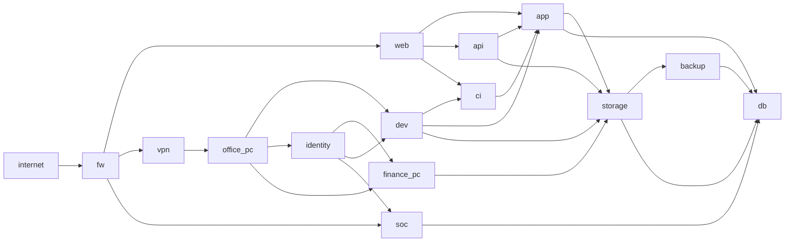

# Level 5: Hybrid Identity Crisis

## Scenario Goal

This scenario is designed for a high-pressure demonstration in which both agents must repeatedly choose between immediate containment and long-term control.

- Red has three reliable initial-entry targets: `fw`, `web`, and `vpn`.
- Blue starts with partial vulnerability intelligence on all three entries, but cannot patch everything quickly.
- `identity` and `db` begin monitored, creating visible defensive depth without removing attack options.
- The topology contains the simulator's reliable hard-path backbone plus several valuable side systems that can become persistence anchors or defensive distractions.

## Topology Shape

## Reliable Attack Chains

The following paths preserve the current simulator's hard-path policy and should remain reliable:

1. `internet -> fw -> web -> app -> db`
2. `internet -> fw -> web -> app -> storage -> db`
3. `internet -> fw -> vpn -> office_pc -> dev -> app -> db`
4. `internet -> fw -> vpn -> office_pc -> dev -> storage -> db`

Side systems add contestable positions:

- `identity`: credential and privilege escalation pressure.
- `ci`: supply-chain persistence opportunity.
- `api`: exposed service distraction and alternate foothold.
- `finance_pc`: user endpoint with business significance.
- `backup`: recovery infrastructure that Blue cannot ignore.
- `soc`: defensive visibility asset that can become a dangerous red foothold.

## Vulnerability Balance

- Entry vulnerabilities have meaningful but non-deterministic exploitation probabilities.
- High-value internal systems generally contain two or three vulnerabilities, forcing Red to select a technique and Blue to prioritize scans and patches.
- Patch probabilities are intentionally uneven. Some urgent vulnerabilities are difficult to remediate, while lower-impact issues are easier to close.
- `db` remains the only core asset so the winner logic stays compatible with the current simulator.

## Recommended Future Run

For a demonstration run, use 20 to 24 rounds with probability gating enabled and a fixed random seed. This should create repeatable uncertainty without making the outcome deterministic.

Do not start the simulation as part of scenario setup.
